# 📘 Manuel d'Utilisation — ImmoPro Premium

**Plateforme de Gestion Immobilière**
**Version** : 1.0 | **Date** : Juin 2026
**Directeur** : M. Mohamed SYLLA | **Siège** : Avenue de la République, Conakry, Guinée

---

> [!NOTE]
> Ce manuel est destiné aux utilisateurs de la plateforme **ImmoPro Premium**. Il décrit l'ensemble des fonctionnalités disponibles et guide l'utilisateur pas à pas dans l'utilisation de chaque module.

---

## Table des Matières

1. [Présentation Générale](#1--présentation-générale)
2. [Page d'Accueil Publique](#2--page-daccueil-publique)
3. [Inscription (Création de Compte)](#3--inscription-création-de-compte)
4. [Connexion à la Plateforme](#4--connexion-à-la-plateforme)
5. [Tableau de Bord (Dashboard)](#5--tableau-de-bord-dashboard)
6. [Barre de Navigation Principale](#6--barre-de-navigation-principale)
7. [Module Biens — Catalogue Immobilier](#7--module-biens--catalogue-immobilier)
8. [Module Biens — Ajouter un Nouveau Bien](#8--module-biens--ajouter-un-nouveau-bien)
9. [Module Biens — Localisation sur la Carte](#9--module-biens--localisation-sur-la-carte)
10. [Module Visites](#10--module-visites)
11. [Module Transactions](#11--module-transactions)
12. [Détail d'une Transaction](#12--détail-dune-transaction)
13. [Suivi des Loyers](#13--suivi-des-loyers)
14. [Module Leads — Pipeline CRM](#14--module-leads--pipeline-crm)
15. [Module Entretien — Gestion des Dépenses](#15--module-entretien--gestion-des-dépenses)
16. [Administration — Gestion des Utilisateurs](#16--administration--gestion-des-utilisateurs)
17. [Gestion des Documents](#17--gestion-des-documents)
18. [Rapports & Statistiques](#18--rapports--statistiques)
19. [Journal d'Audit](#19--journal-daudit)
20. [Paramètres Système](#20--paramètres-système)

---

## 1 — Présentation Générale

**ImmoPro Premium** est une plateforme complète de gestion immobilière conçue pour les professionnels de l'immobilier en Guinée. Elle permet de :

- 🏠 Gérer un catalogue de biens immobiliers (ventes et locations)
- 📅 Planifier et suivre les visites de propriétés
- 💰 Enregistrer et suivre les transactions financières
- 🔑 Gérer les locations et le suivi des loyers mensuels
- 📊 Suivre les leads et prospects via un pipeline CRM
- 🔧 Gérer l'entretien et les dépenses liées aux propriétés
- 👥 Administrer les utilisateurs et leurs rôles
- 📄 Centraliser les documents (contrats, factures)
- 📈 Générer des rapports et statistiques
- 🔐 Assurer la traçabilité via un journal d'audit

### Rôles Utilisateurs

| Rôle | Description |
|------|-------------|
| **Super Administrateur** | Accès complet à toutes les fonctionnalités et paramètres système |
| **Agent Immobilier** | Gestion des biens, visites, transactions et leads |
| **Propriétaire** | Consultation de ses biens et suivi des transactions |
| **Client** | Recherche de biens et demande de visites |

---

## 2 — Page d'Accueil Publique

La page d'accueil est la vitrine publique de la plateforme ImmoPro Premium. Elle est accessible sans connexion et permet aux visiteurs de découvrir les biens disponibles.

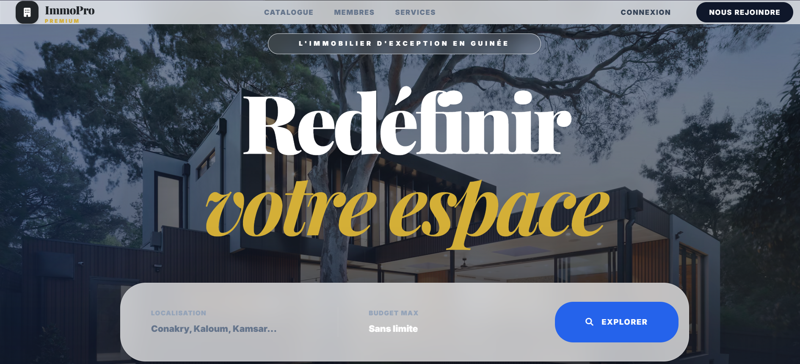

### Éléments de la page d'accueil

| Élément | Description |
|---------|-------------|
| **Logo & Nom** | « ImmoPro Premium » en haut à gauche |
| **Menu de navigation** | Catalogue, Membres, Services, Connexion, Nous Rejoindre |
| **Slogan** | « Redéfinir votre espace » — met en avant le positionnement haut de gamme |
| **Sous-titre** | « L'immobilier d'exception en Guinée » |
| **Barre de recherche** | Permet de filtrer par **Localisation** (Conakry, Kaloum, Kamsar…) et **Budget Max** |
| **Bouton Explorer** | Lance la recherche et affiche les résultats du catalogue |

### Comment utiliser la recherche

1. Cliquez sur le champ **Localisation** et sélectionnez une ou plusieurs villes
2. Définissez un **Budget Max** (ou laissez « Sans limite »)
3. Cliquez sur le bouton bleu **🔍 EXPLORER**
4. Les résultats s'affichent dans le catalogue

---

## 3 — Inscription (Création de Compte)

Pour accéder aux fonctionnalités de la plateforme, les nouveaux utilisateurs doivent créer un compte.

### Étapes d'inscription

1. Depuis la page d'accueil, cliquez sur **« NOUS REJOINDRE »** ou **« Créez votre compte client »**
2. Remplissez le formulaire avec les informations suivantes :

| Champ | Format attendu | Exemple |
|-------|---------------|---------|
| **Nom Complet** | Prénom et nom | Jean Dupont |
| **Adresse Email** | Email valide | admin@immopro.gn |
| **Numéro de Téléphone** | Format international | +224 620 00 00 00 |
| **Type de Compte** | Liste déroulante | Client (Recherche un bien) |
| **Mot de Passe** | 8 caractères minimum | ●●●●●●●● |
| **Confirmation Mot de Passe** | Identique au mot de passe | ●●●●●●●● |

3. Cliquez sur le bouton **S'INSCRIRE** pour valider

> [!IMPORTANT]
> Le **type de compte** détermine les fonctionnalités auxquelles vous aurez accès. Choisissez « Client » si vous recherchez un bien, ou contactez l'administrateur pour un compte Agent ou Propriétaire.

---

## 4 — Connexion à la Plateforme

Si vous possédez déjà un compte, vous pouvez vous connecter à la plateforme.

### Procédure de connexion

1. Cliquez sur **« CONNEXION »** depuis le menu principal
2. Saisissez votre **Adresse Email**
3. Saisissez votre **Mot de Passe**
4. *(Optionnel)* Cochez **« Rester connecté »** pour maintenir votre session
5. Cliquez sur le bouton **➡️ SE CONNECTER**

### Fonctionnalités supplémentaires

- **Mot de passe oublié ?** — Cliquez sur le lien **« OUBLIÉ ? »** à côté du champ mot de passe pour réinitialiser
- **Retour à l'accueil** — Le bouton **« ← RETOUR À L'ACCUEIL »** vous ramène à la page publique
- **Créer un compte** — Le lien **« Créez votre compte client »** en bas redirige vers la page d'inscription

### Statistiques affichées sur la page de connexion

La page affiche des chiffres clés démontrant la crédibilité de la plateforme :
- **500+** Biens référencés
- **1200+** Clients actifs
- **98%** Taux de satisfaction

---

## 5 — Tableau de Bord (Dashboard)

Après connexion, vous accédez au tableau de bord qui offre une vue d'ensemble de l'activité de l'agence.

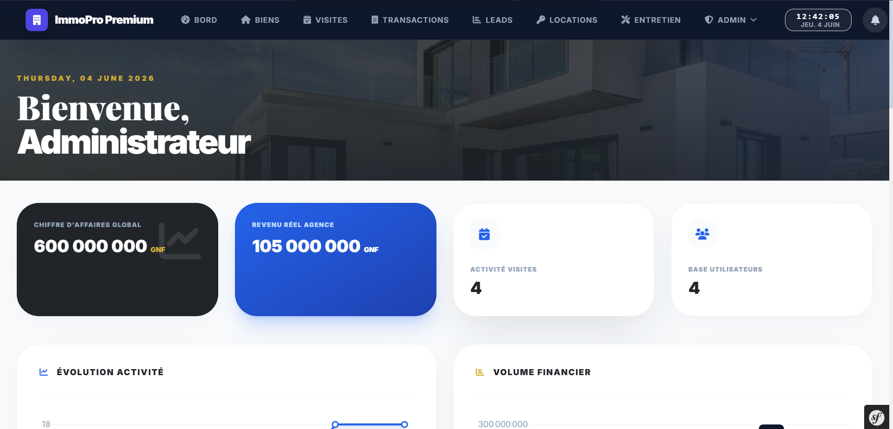

### Indicateurs Clés (KPI)

Le tableau de bord présente quatre cartes d'indicateurs principaux :

| Indicateur | Description | Exemple |
|-----------|-------------|---------|
| **Chiffre d'Affaires Global** | Montant total des transactions | 600 000 000 GNF |
| **Revenu Réel Agence** | Commission nette perçue par l'agence | 105 000 000 GNF |
| **Activité Visites** | Nombre de visites planifiées/effectuées | 4 |
| **Base Utilisateurs** | Nombre total d'utilisateurs inscrits | 4 |

### Graphiques

Le tableau de bord inclut deux graphiques dynamiques :
- **📈 Évolution Activité** — Courbe d'évolution de l'activité commerciale dans le temps
- **📊 Volume Financier** — Histogramme des volumes financiers par période

### Informations contextuelles

- La **date et l'heure** sont affichées en temps réel en haut à droite
- Un message de **bienvenue personnalisé** s'affiche avec le rôle de l'utilisateur (ex: « Bienvenue, Administrateur »)

---

## 6 — Barre de Navigation Principale

La barre de navigation est présente sur toutes les pages de l'espace connecté et donne accès à tous les modules.

### Modules accessibles

| Icône | Module | Description |
|-------|--------|-------------|
| 🎯 | **BORD** | Tableau de bord — Vue d'ensemble |
| 🏠 | **BIENS** | Catalogue et gestion des propriétés |
| 📅 | **VISITES** | Planification et suivi des visites |
| 📋 | **TRANSACTIONS** | Enregistrement et suivi des transactions |
| 📊 | **LEADS** | Pipeline CRM — Gestion des prospects |
| 🔑 | **LOCATIONS** | Gestion des contrats de location |
| 🔧 | **ENTRETIEN** | Suivi des dépenses et de la maintenance |
| ⚙️ | **ADMIN** | Menu déroulant avec accès aux paramètres, utilisateurs, etc. |

### Éléments de la barre

- **Logo ImmoPro Premium** — Retour au tableau de bord en cliquant dessus
- **Horloge** — Affiche l'heure en temps réel et la date du jour (ex: « 12:41:25 JEU. 4 JUIN »)
- **🔔 Cloche de notifications** — Affiche les alertes et notifications (avec badge numérique si non lues)

---

## 7 — Module Biens — Catalogue Immobilier

Le module **Biens** est le cœur de la plateforme. Il permet de consulter, rechercher et gérer l'ensemble des propriétés.

### En-tête du catalogue

L'en-tête affiche :
- Le titre **« Collection Immobilière »** avec le badge **« CATALOGUE EXCLUSIF »**
- Un bouton **« + NOUVEAU BIEN »** en haut à droite pour ajouter une propriété
- Un bouton retour **←** pour revenir au tableau de bord

### Liste des biens avec filtres

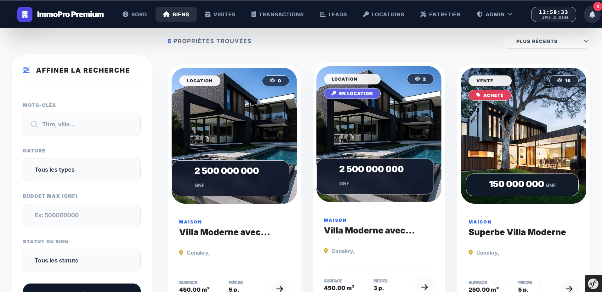

### Panneau de filtres (colonne gauche)

| Filtre | Description |
|--------|-------------|
| **Mots-clés** | Recherche par titre ou ville |
| **Nature** | Type de transaction (Tous les types, Vente, Location) |
| **Budget Max (GNF)** | Montant maximum souhaité |
| **Statut du bien** | Tous les statuts, Disponible, En location, Acheté |

### Cartes de propriétés

Chaque bien est affiché sous forme de **carte** contenant :
- **Photo principale** du bien
- **Badge de type** : « LOCATION » (bleu) ou « VENTE » (blanc)
- **Badge de statut** : « EN LOCATION » (violet), « ACHETÉ » (rouge/rose)
- **Compteur de vues** : 👁 (nombre de consultations)
- **Prix** affiché en GNF dans un encadré sombre
- **Type de bien** : MAISON, APPARTEMENT, TERRAIN, etc.
- **Titre** du bien
- **📍 Localisation** (ville)
- **Surface** en m² et **Nombre de pièces**
- **Flèche →** pour accéder aux détails

### Tri des résultats

Un menu déroulant **« PLUS RÉCENTS »** en haut à droite permet de trier les résultats par :
- Plus récents
- Prix croissant / décroissant
- Surface

Le compteur affiche le nombre total de résultats (ex : « **6** PROPRIÉTÉS TROUVÉES »)

---

## 8 — Module Biens — Ajouter un Nouveau Bien

L'ajout d'un nouveau bien se fait via un formulaire complet accessible depuis le bouton **« + NOUVEAU BIEN »**.

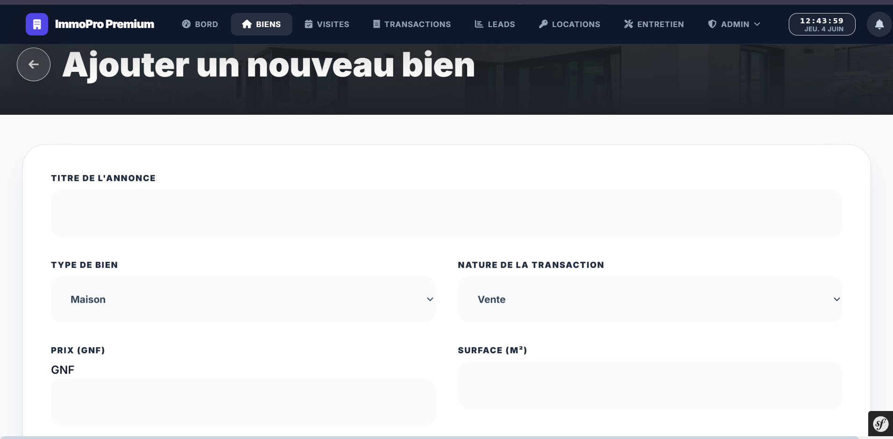

### Champs du formulaire

| Champ | Type | Description |
|-------|------|-------------|
| **Titre de l'annonce** | Texte libre | Nom descriptif du bien |
| **Type de bien** | Liste déroulante | Maison, Appartement, Terrain, Bureau, Commerce |
| **Nature de la transaction** | Liste déroulante | Vente, Location |
| **Prix (GNF)** | Numérique | Prix en Francs Guinéens |
| **Surface (m²)** | Numérique | Surface habitable en mètres carrés |

> [!TIP]
> Le formulaire contient d'autres champs en dessous (nombre de pièces, description, photos, localisation). Faites défiler la page pour accéder à l'ensemble des champs et à la carte de localisation.

### Procédure d'ajout

1. Cliquez sur **« + NOUVEAU BIEN »** depuis le catalogue
2. Remplissez tous les champs obligatoires
3. Ajoutez des **photos** du bien (glisser-déposer ou parcourir)
4. Définissez la **localisation** sur la carte interactive
5. Cliquez sur **« ENREGISTRER »** pour publier le bien

---

## 9 — Module Biens — Localisation sur la Carte

Lors de l'ajout ou de la modification d'un bien, une carte interactive permet de définir l'emplacement exact de la propriété.

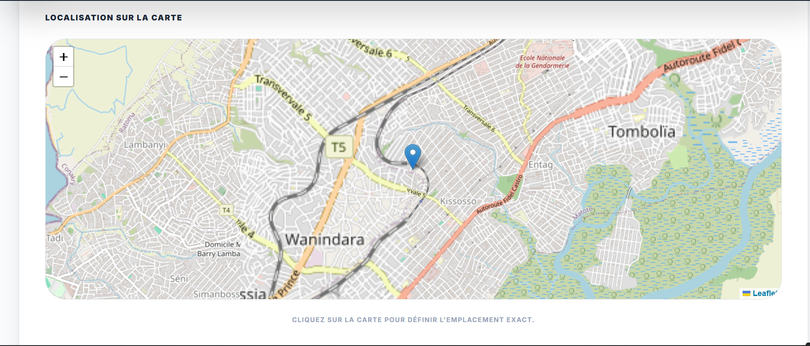

### Utilisation de la carte

- La carte est alimentée par **Leaflet** (OpenStreetMap)
- **Cliquez sur la carte** pour placer le marqueur bleu à l'emplacement exact du bien
- Utilisez les boutons **+** et **−** pour zoomer/dézoomer
- L'instruction **« Cliquez sur la carte pour définir l'emplacement exact »** guide l'utilisateur
- La carte est centrée sur **Conakry** par défaut, couvrant les quartiers de Wanindara, Kissosso, Tombolia, Lambanyi, etc.

> [!NOTE]
> La localisation est importante pour l'affichage du bien dans les résultats de recherche par zone géographique. Placez le marqueur le plus précisément possible.

---

## 10 — Module Visites

Le module **Visites** permet de planifier, suivre et gérer les rendez-vous de visite des propriétés.

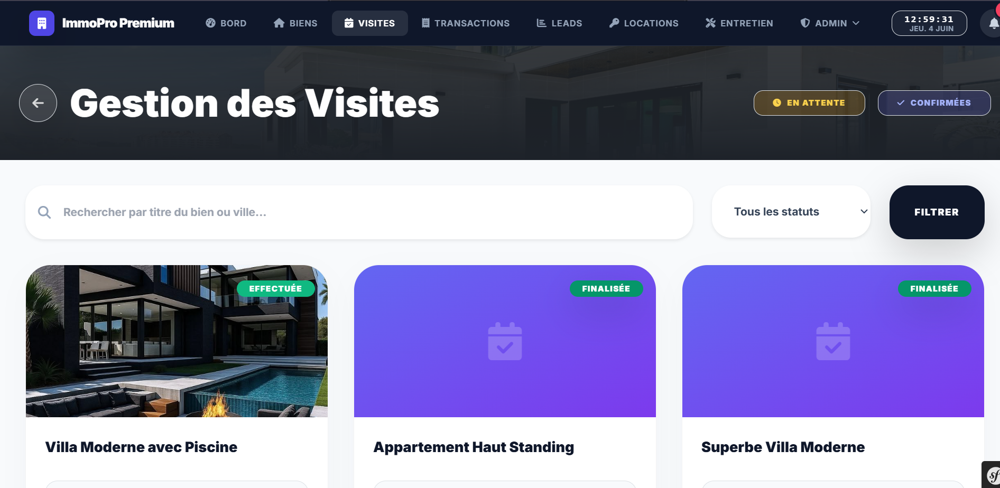

### Filtrage des visites

Deux onglets principaux permettent de filtrer :
- **⏳ EN ATTENTE** — Visites en attente de confirmation
- **✅ CONFIRMÉES** — Visites confirmées et planifiées

### Barre de recherche

- Recherchez par **titre du bien** ou **ville**
- Filtrez par **statut** via le menu déroulant « Tous les statuts »
- Cliquez sur **FILTRER** pour appliquer les critères

### Cartes de visites

Chaque visite est affichée avec :
- **Photo du bien** (ou icône calendrier si pas de photo)
- **Badge de statut** :
  - 🟢 **EFFECTUÉE** — La visite a eu lieu
  - 🟣 **FINALISÉE** — La visite est terminée et documentée
  - 🟡 **EN ATTENTE** — En attente de confirmation
  - 🔵 **CONFIRMÉE** — Visite planifiée
- **Titre du bien** concerné (ex: « Villa Moderne avec Piscine »)

### Actions possibles

- Cliquer sur une carte pour voir les **détails de la visite**
- **Confirmer** ou **annuler** une visite en attente
- **Ajouter un compte-rendu** après une visite effectuée

---

## 11 — Module Transactions

Le module **Transactions** centralise toutes les opérations financières liées aux ventes et locations.

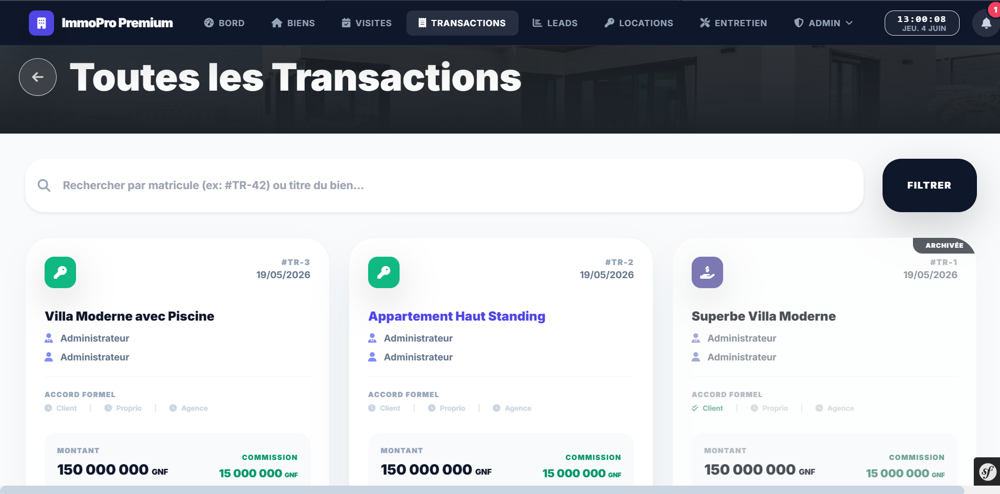

### Recherche de transactions

- Recherchez par **matricule** (ex: #TR-42) ou **titre du bien**
- Cliquez sur **FILTRER** pour affiner les résultats

### Cartes de transactions

Chaque transaction affiche :

| Élément | Description |
|---------|-------------|
| **Icône de type** | 🔑 Location (vert) ou 📥 Vente (violet) |
| **Matricule** | Identifiant unique (ex: #TR-3) |
| **Date** | Date de l'acte (ex: 19/05/2026) |
| **Titre du bien** | Nom de la propriété concernée |
| **Parties** | Noms du vendeur/bailleur et de l'acheteur/locataire |
| **Accord Formel** | Statut des signatures : Client ✅, Proprio ⏳, Agence ⏳ |
| **Montant** | Prix de la transaction en GNF |
| **Commission** | Commission de l'agence en GNF |
| **Badge** | « ARCHIVÉE » pour les transactions terminées |

---

## 12 — Détail d'une Transaction

En cliquant sur une transaction, vous accédez à sa fiche détaillée.

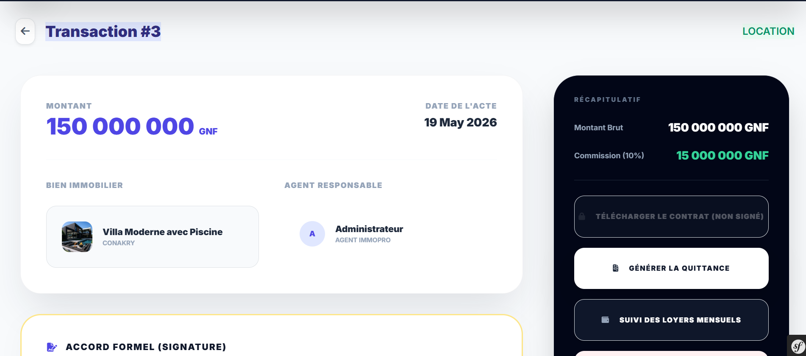

### Informations affichées

**Section principale :**
- **Montant** : Prix total de la transaction (ex: 150 000 000 GNF)
- **Date de l'acte** : Date officielle de la transaction (ex: 19 May 2026)
- **Bien Immobilier** : Titre et localisation du bien avec miniature
- **Agent Responsable** : Nom et rôle de l'agent en charge
- **Type** : « LOCATION » ou « VENTE » affiché en haut à droite

**Récapitulatif (panneau latéral sombre) :**
- **Montant Brut** : Prix total
- **Commission (10%)** : Part de l'agence

### Actions disponibles

| Bouton | Description |
|--------|-------------|
| **🔒 Télécharger le Contrat (Non signé)** | Télécharge le modèle de contrat |
| **📄 Générer la Quittance** | Génère un reçu de paiement |
| **📋 Suivi des Loyers Mensuels** | Accède au suivi des loyers (pour les locations) |

### Accord Formel (Signature)

La section **Accord Formel** en bas permet de suivre les signatures des trois parties :
- ✅ **Client** — Signature validée
- ⏳ **Propriétaire** — En attente
- ⏳ **Agence** — En attente

---

## 13 — Suivi des Loyers

Pour les transactions de type **Location**, un module dédié permet le suivi mensuel des loyers.

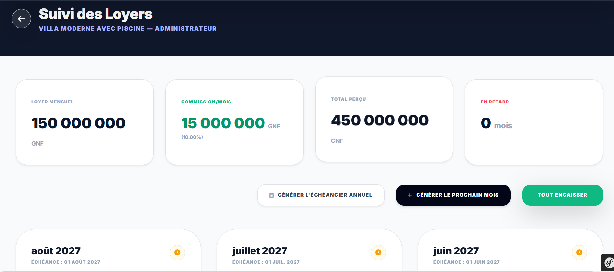

### Indicateurs de loyer

| Indicateur | Description | Exemple |
|-----------|-------------|---------|
| **Loyer Mensuel** | Montant du loyer par mois | 150 000 000 GNF |
| **Commission/Mois** | Commission de l'agence par mois (pourcentage) | 15 000 000 GNF (10%) |
| **Total Perçu** | Total cumulé des loyers perçus | 450 000 000 GNF |
| **En Retard** | Nombre de mois de retard de paiement | 0 mois |

### Actions de gestion

| Bouton | Description |
|--------|-------------|
| **📅 Générer l'Échéancier Annuel** | Crée automatiquement les 12 échéances de l'année |
| **➕ Générer le Prochain Mois** | Ajoute une échéance pour le mois suivant |
| **💚 Tout Encaisser** | Marque tous les loyers en attente comme encaissés |

### Échéancier mensuel

L'échéancier affiche chaque mois avec :
- **Nom du mois et année** (ex: août 2027)
- **Date d'échéance** (ex: 01 août 2027)
- **Icône de statut** : 🟡 En attente / ✅ Payé / 🔴 En retard

---

## 14 — Module Leads — Pipeline CRM

Le module **Leads** offre un pipeline de type CRM (Customer Relationship Management) pour gérer les prospects commerciaux.

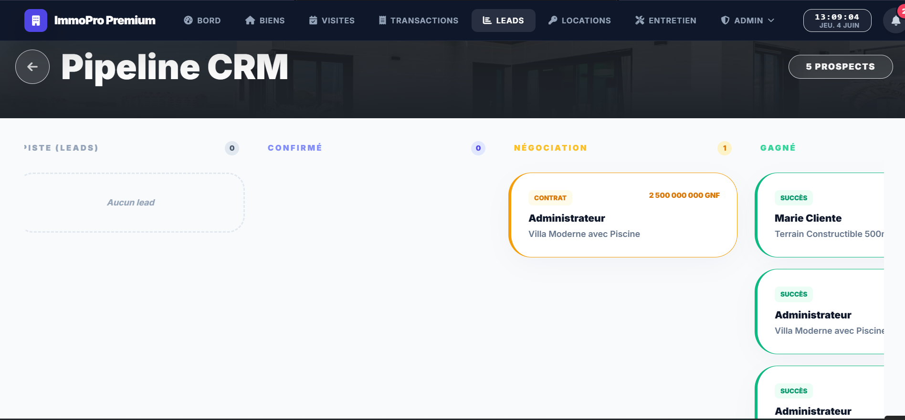

### Colonnes du Pipeline

Le pipeline est organisé en **4 colonnes** représentant les étapes du cycle de vente :

| Colonne | Description | Badge |
|---------|-------------|-------|
| **PISTE (LEADS)** | Premiers contacts, prospects identifiés | Compteur gris |
| **CONFIRMÉ** | Prospects ayant confirmé leur intérêt | Compteur gris |
| **NÉGOCIATION** | Prospects en phase de négociation | Compteur orange |
| **GAGNÉ** | Transactions réussies | Compteur vert |

### Cartes de leads

Chaque lead affiche :
- **Badge de statut** : CONTRAT (orange) ou SUCCÈS (vert)
- **Nom du client** (ex: Marie Cliente, Administrateur)
- **Bien concerné** (ex: Villa Moderne avec Piscine)
- **Montant** affiché pour les leads en négociation (ex: 2 500 000 GNF)

### Utilisation du pipeline

1. Les nouveaux prospects apparaissent dans **PISTE**
2. Lorsqu'un prospect confirme son intérêt, déplacez-le vers **CONFIRMÉ**
3. Pendant les discussions de prix, le lead passe en **NÉGOCIATION**
4. Une fois la transaction conclue, le lead est marqué comme **GAGNÉ**

Le bouton **« 5 PROSPECTS »** en haut à droite affiche le nombre total de leads actifs.

---

## 15 — Module Entretien — Gestion des Dépenses

Ce module permet de suivre et gérer les charges financières liées à l'entretien des propriétés.

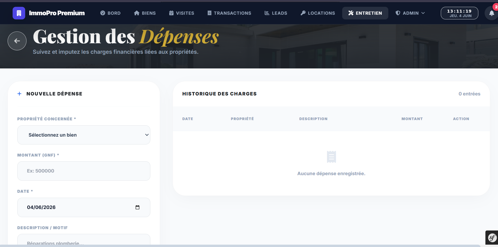

### Formulaire « Nouvelle Dépense » (colonne gauche)

| Champ | Description |
|-------|-------------|
| **Propriété Concernée** * | Sélectionnez le bien dans la liste déroulante |
| **Montant (GNF)** * | Montant de la dépense (ex: 500000) |
| **Date** * | Date de la dépense (format jj/mm/aaaa) |
| **Description / Motif** | Description libre (ex: Réparations plomberie…) |

> [!TIP]
> Les champs marqués d'un astérisque (*) sont obligatoires. Pensez à bien renseigner le motif pour faciliter le suivi comptable.

### Historique des Charges (colonne droite)

Le tableau d'historique affiche :

| Colonne | Description |
|---------|-------------|
| **Date** | Date de la dépense |
| **Propriété** | Bien concerné |
| **Description** | Motif de la dépense |
| **Montant** | Montant en GNF |
| **Action** | Boutons de modification/suppression |

Le compteur **« 0 entrées »** indique le nombre total de dépenses enregistrées.

---

## 16 — Administration — Gestion des Utilisateurs

Accessible via le menu **ADMIN**, ce module permet de gérer les comptes utilisateurs et leurs rôles.

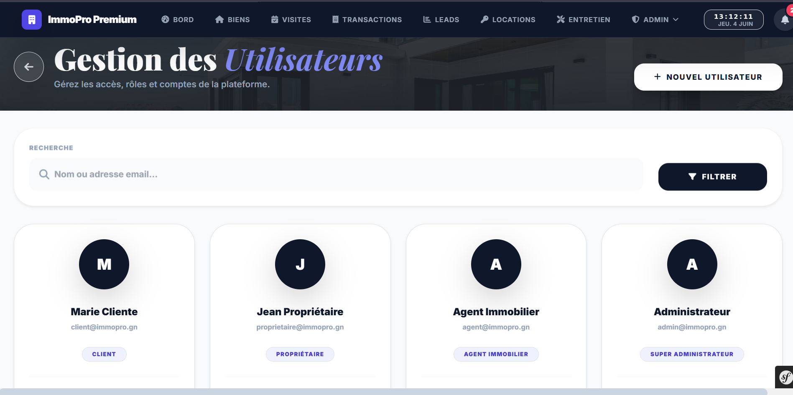

### Recherche d'utilisateurs

- Utilisez la barre de recherche pour trouver un utilisateur par **nom** ou **adresse email**
- Cliquez sur **🔍 FILTRER** pour lancer la recherche

### Cartes utilisateurs

Chaque utilisateur est représenté par une carte contenant :
- **Avatar** avec l'initiale du prénom (cercle coloré)
- **Nom complet** (ex: Marie Cliente)
- **Email** (ex: client@immopro.gn)
- **Badge de rôle** avec code couleur :
  - 🔵 **CLIENT**
  - 🟣 **PROPRIÉTAIRE**
  - 🔷 **AGENT IMMOBILIER**
  - 🟠 **SUPER ADMINISTRATEUR**

### Actions

| Action | Description |
|--------|-------------|
| **+ NOUVEL UTILISATEUR** | Créer un nouveau compte utilisateur |
| **Cliquer sur une carte** | Accéder au profil détaillé et modifier les informations |
| **Modifier le rôle** | Changer le niveau d'accès d'un utilisateur |
| **Désactiver** | Suspendre temporairement un compte |

> [!WARNING]
> Seuls les **Super Administrateurs** ont accès à la gestion des utilisateurs. La modification des rôles impacte directement les permissions de l'utilisateur.

---

## 17 — Gestion des Documents

Le module de gestion documentaire centralise tous les fichiers liés aux transactions.

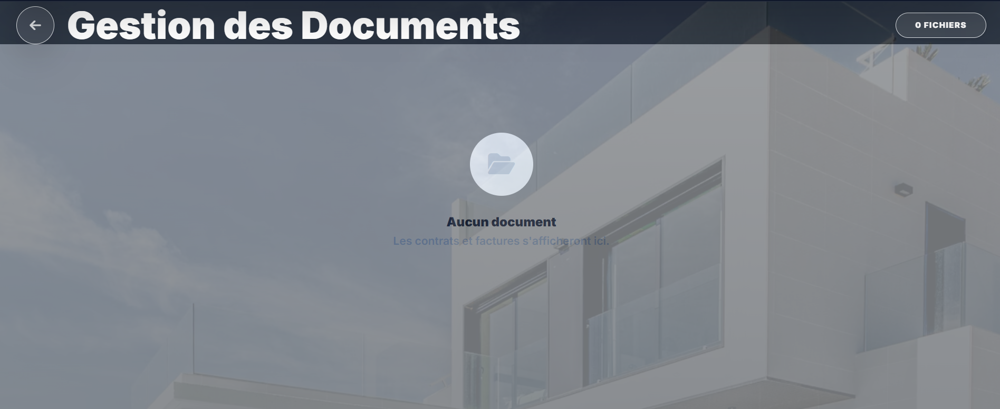

### Fonctionnalités

- **Stockage centralisé** des contrats et factures
- **Compteur de fichiers** affiché en haut à droite (ex: « 0 FICHIERS »)
- **État vide** : Le message « Aucun document — Les contrats et factures s'afficheront ici » s'affiche quand il n'y a pas encore de documents
- **Bouton retour ←** pour revenir à la page précédente

### Types de documents gérés

- 📄 Contrats de vente
- 📄 Contrats de location
- 🧾 Factures
- 📋 Quittances de loyer
- 📝 Procès-verbaux de visite

---

## 18 — Rapports & Statistiques

Ce module fournit des analyses détaillées de l'activité de l'agence avec la possibilité d'exporter en PDF.

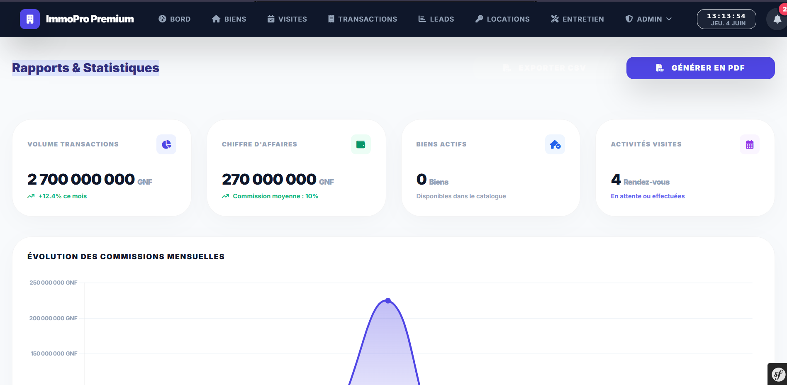

### Indicateurs KPI

| Indicateur | Valeur | Détail |
|-----------|--------|--------|
| **Volume Transactions** | 2 700 000 000 GNF | +12.4% ce mois |
| **Chiffre d'Affaires** | 270 000 000 GNF | Commission moyenne : 10% |
| **Biens Actifs** | 0 Biens | Disponibles dans le catalogue |
| **Activités Visites** | 4 Rendez-vous | En attente ou effectuées |

### Graphique : Évolution des Commissions Mensuelles

Un graphique en courbe (area chart) affiche l'évolution des commissions mensuelles en GNF sur l'axe temporel, permettant de visualiser les tendances de revenus.

### Export

Le bouton violet **« 🖨 GÉNÉRER EN PDF »** en haut à droite permet d'exporter l'ensemble du rapport en format PDF pour impression ou archivage.

---

## 19 — Journal d'Audit

Le journal d'audit assure la **sécurité et la traçabilité** de toutes les actions effectuées sur la plateforme.

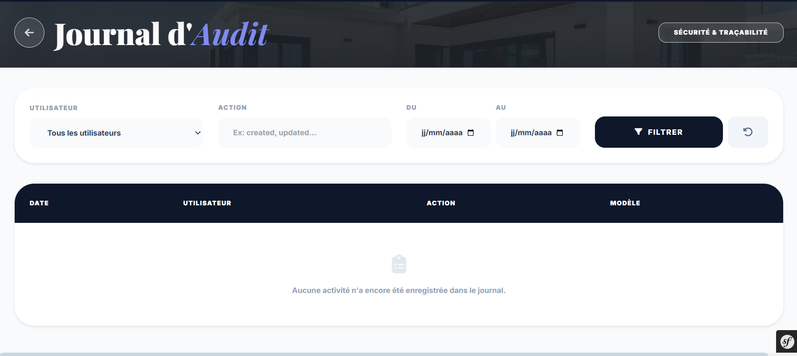

### Filtres de recherche

| Filtre | Description |
|--------|-------------|
| **Utilisateur** | Sélectionnez un utilisateur spécifique ou « Tous les utilisateurs » |
| **Action** | Type d'action (ex: created, updated, deleted) |
| **Du** | Date de début de la période (format jj/mm/aaaa) |
| **Au** | Date de fin de la période (format jj/mm/aaaa) |
| **🔍 FILTRER** | Appliquer les filtres |
| **🔄 Réinitialiser** | Remettre les filtres à zéro |

### Tableau d'activités

Le tableau d'audit affiche les colonnes suivantes :

| Colonne | Description |
|---------|-------------|
| **Date** | Date et heure de l'action |
| **Utilisateur** | Nom de l'utilisateur ayant effectué l'action |
| **Action** | Type d'opération (création, modification, suppression) |
| **Modèle** | Entité concernée (Bien, Transaction, Utilisateur, etc.) |

> [!CAUTION]
> Le journal d'audit est en **lecture seule**. Les entrées ne peuvent pas être modifiées ni supprimées pour garantir l'intégrité de la traçabilité.

---

## 20 — Paramètres Système

Les paramètres système permettent de configurer l'identité et le fonctionnement global de la plateforme.

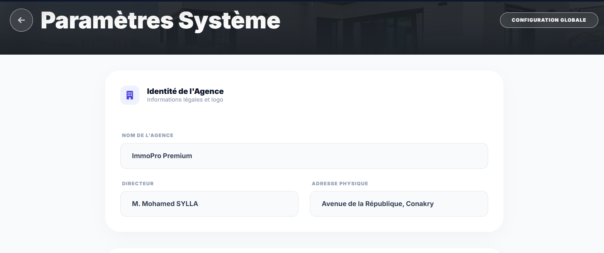

### Identité de l'Agence

| Paramètre | Description | Valeur actuelle |
|-----------|-------------|-----------------|
| **Nom de l'Agence** | Raison sociale | ImmoPro Premium |
| **Directeur** | Nom du responsable | M. Mohamed SYLLA |
| **Adresse Physique** | Siège social | Avenue de la République, Conakry |

### Informations complémentaires

La section **Identité de l'Agence** contient :
- Le **logo** de l'agence (icône violette ImmoPro)
- Le sous-titre « Informations légales et logo »
- Le badge **« CONFIGURATION GLOBALE »** en haut à droite

> [!IMPORTANT]
> Les modifications des paramètres système sont appliquées **globalement** et affectent tous les utilisateurs. Seuls les Super Administrateurs peuvent modifier ces paramètres.

### Autres paramètres disponibles

- Configuration des taux de commission
- Personnalisation des modèles de documents (contrats, quittances)
- Gestion des notifications
- Configuration des devises et formats

---

## Annexe — Raccourcis & Astuces

### Navigation rapide

| Raccourci | Action |
|-----------|--------|
| Cliquer sur le logo **ImmoPro Premium** | Retour au tableau de bord |
| Bouton **←** | Retour à la page précédente |
| **🔔** Cloche | Voir les notifications |

### Bonnes pratiques

> [!TIP]
> - **Complétez les fiches** : Plus les informations d'un bien sont détaillées, meilleure sera la visibilité auprès des clients
> - **Mettez à jour les statuts** : Changez le statut des visites et transactions en temps réel
> - **Utilisez les filtres** : Chaque module propose des filtres avancés pour retrouver rapidement les informations
> - **Exportez régulièrement** : Utilisez la fonction « Générer en PDF » des rapports pour archiver les données
> - **Consultez le journal d'audit** : Vérifiez régulièrement les actions effectuées pour maintenir la traçabilité

---

## Support & Contact

Pour toute question ou assistance technique :

| Canal | Information |
|-------|-------------|
| **Email** | admin@immopro.gn |
| **Téléphone** | +224 620 00 00 00 |
| **Adresse** | Avenue de la République, Conakry, Guinée |

---

*© 2026 ImmoPro Premium — Tous droits réservés*
*Document rédigé le 06 Juin 2026*
