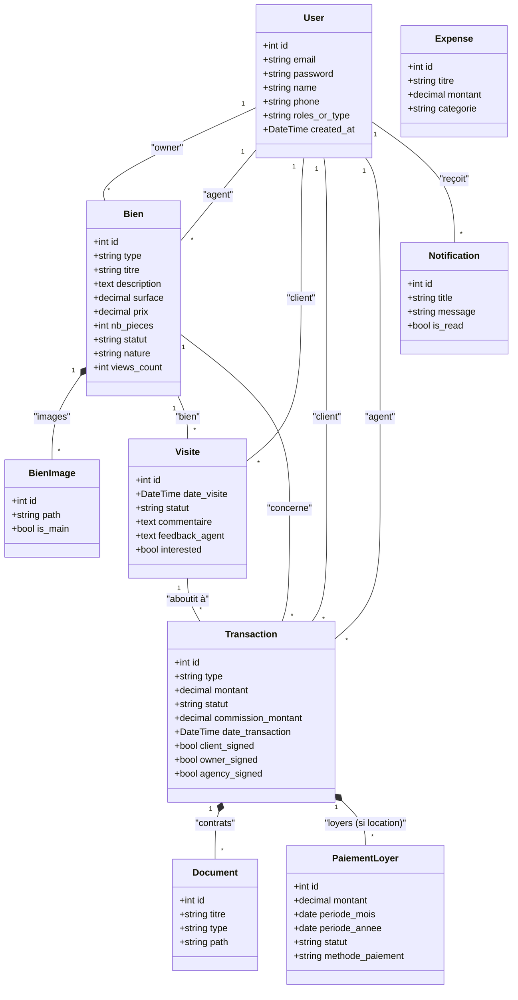

# Spécifications Fonctionnelles et Techniques - ImmoPro (Éditions Symfony & Laravel)

## 1. Présentation du Projet
**ImmoPro** est une application web de gestion immobilière premium destinée aux agences immobilières. Elle permet de gérer de bout en bout le cycle de vie d'un bien immobilier, de sa mise en ligne jusqu'à la signature du contrat, en passant par la gestion des visites, la négociation (CRM) et la facturation.

Le projet a la particularité d'être développé en **deux versions miroirs** utilisant les deux frameworks PHP majeurs du marché : **Symfony** et **Laravel**. Les deux versions partagent exactement les mêmes fonctionnalités et la même structure de base de données.

* **Dépôt Symfony** : [https://github.com/JoeCoolCapelo/ImmoPro_Symfony.git](https://github.com/JoeCoolCapelo/ImmoPro_Symfony.git)
* **Dépôt Laravel** : [https://github.com/JoeCoolCapelo/ImmoPro_laravel.git](https://github.com/JoeCoolCapelo/ImmoPro_laravel.git)

---

## 2. Spécifications Fonctionnelles (Communes aux deux versions)

L'application est structurée autour de plusieurs modules principaux adaptés à différents types d'utilisateurs.

### 2.1. Gestion des Utilisateurs et Rôles
* **Administrateur (`ROLE_ADMIN` / `admin`)** : Accès global à la plateforme (Paramètres de l'agence, gestion des utilisateurs, rapports financiers, audit logs).
* **Agent Immobilier (`ROLE_AGENT` / `agent`)** : Gère les biens qui lui sont assignés, suit ses leads dans le CRM, organise les visites et prépare les transactions.
* **Propriétaire (`ROLE_OWNER` / `owner`)** : Visualise ses biens, suit leurs performances (vues, visites planifiées) et signe électroniquement les contrats.
* **Client / Prospect (`ROLE_USER` / `user`)** : Consulte le catalogue, demande des visites, ajoute des biens en favoris, et signe électroniquement ses contrats.

### 2.2. Gestion du Catalogue (Biens Immobiliers)
* Création, modification et archivage de biens (Maison, Appartement, Terrain, Local commercial).
* Galerie d'images multiple par bien (avec définition de l'image principale).
* Géolocalisation (Latitude, Longitude), adresse complète.
* Suivi des performances via un compteur de vues (`views_count`).
* Cycle de vie et statuts : brouillon, en attente, publié, vendu, loué.

### 2.3. Gestion des Visites et CRM (Pipeline)
* **Demande de visite** par le client.
* **Suivi Agent** : Renseignement des retours (feedback) et commentaires suite à la visite.
* **Pipeline CRM** : Interface Kanban pour le suivi d'état des leads (Visites en attente -> Confirmées -> Négociation -> Gagné).

### 2.4. Gestion des Transactions et Contrats
* Conversion de visites réussies en transactions (Ventes ou Locations).
* Calculs financiers (montant, commission de l'agence).
* **Signature électronique certifiée** : Signature tripartite (Client, Propriétaire, Agence) avec horodatage et capture d'IP.
* Génération automatique des contrats en format **PDF**.

### 2.5. Suivi Financier
* **Paiements de loyers** : Génération de reçus, suivi des retards.
* **Dépenses (Entretien)** : Suivi des frais liés à l'agence ou à l'entretien spécifique des biens.

---

## 3. Spécifications Techniques Comparées

Bien que les fonctionnalités soient identiques, les choix architecturaux diffèrent selon l'écosystème du framework utilisé.

| Composant / Couche | Version Symfony | Version Laravel |
| :--- | :--- | :--- |
| **Langage Backend** | PHP 8.4 | PHP 8.x |
| **Framework Core** | Symfony 7.2 | Laravel 11.x |
| **Architecture** | MVC (Modèle-Vue-Contrôleur) | MVC (Modèle-Vue-Contrôleur) |
| **Base de Données** | MariaDB (v10.10.2) | MariaDB / MySQL |
| **ORM / BDD** | Doctrine ORM | Eloquent ORM |
| **Moteur de Templates** | Twig | Blade |
| **Design & UI** | Tailwind CSS (Symfonycasts Bundle) | Tailwind CSS (Vite / Mix) |
| **Génération PDF** | DomPDF | DomPDF (via barryvdh/laravel-dompdf) |
| **Système de Routing** | Attributs PHP (`#[Route]`) | Fichiers de routes (`routes/web.php`) |
| **Authentification** | Symfony Security (Guard/Form Login) | Laravel Breeze / Fortify |

---

## 4. Modélisation des Données (Diagramme UML)

La base de données est conceptuellement identique entre les deux versions (seules les conventions de nommage des tables pivot diffèrent légèrement : ex. `favorites` sous Symfony vs `bien_user` sous Laravel, ou la gestion automatique des timestamps).

Voici le diagramme de classes de l'architecture de la base de données :

> [!TIP]
> **Cohérence Multi-Framework**
> Le fait de maintenir deux dépôts avec des technologies différentes (Symfony / Laravel) mais une base de données et des fonctionnalités identiques démontre une forte capacité d'abstraction architecturale. L'UI (Tailwind CSS) et l'UX restent identiques, permettant aux utilisateurs finaux de ne voir aucune différence, quel que soit le moteur backend utilisé.
